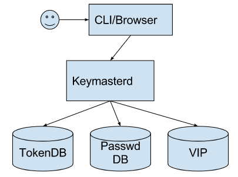

# keymaster
Keymaster is usable short term certificate based identity system. With a primary goal to be a single-sign-on (with optional second factor with [Symantec Vip](https://vip.symantec.com/) or [U2F](https://fidoalliance.org/specifications/overview/) tokens) for CLI operations (both SSHD and TLS).

This system is easy to use, configure and administer.
Keymaster is made of several components: keymaster (the client side binary used to get the certificates), keymasterd (the server side component used to generate the certs), eventmon (the auditing tool to observe and verify keymasterd operation), and keymaster-unlocker(which allows users to unlock keymasterd to start operations).

From the user's perspective a single command is needed with no flags (after the first run). After running the client command successfully users get a 16h (or less) ssh and TLS certificates. On systems with a running [ssh-agent](https://en.wikipedia.org/wiki/Ssh-agent) the command also injects the certificate (with matching expiration time) so that no other interaction is needed to start using it with ssh.

For the service operators it requires adding the keymaster certificates to the set of trusted certificates.

In general the relationship between components is shown here:

Please see the
[design document](https://docs.google.com/document/d/1AW3UROCJqTc3R4MLJXxmPUNS0OFNcsiQJ_Q4j--5tQE/pub) for more information.

## Getting Started

You can use the prebuilt binaries at the [releases page](https://github.com/Symantec/keymaster/releases) or you can build it from source. The rpm and deb packages contain both server and client binaries. The tarballs only contain the client side.

### Building from Source

#### Prerequisites
* go >= 1.8
* make
* gcc

For windows we have used [TDM-GCC (64 bit)](https://sourceforge.net/projects/tdm-gcc/) for both gcc and gnu-make.

#### Building

1. make get-deps
2. make

This will leave you with four binaries: keymasterd, keymaster,   keymaster-unlocker, and keymaster-eventmond.

### Running

#### keymasterd (server)

##### Configuring
You will need to create a new valid server config. Keymaster facilitates this
with the options `-generateConfig  -alsoLogToStderr`. After running the keymaster binary with
these option you will be left with a valid config with an encrypted master secret and self signed certificates SSL certificates. This config file will also be using an apache password file for user authentication.

Notice: we have a current bug where the directory locations are not written correctly. For systems using this is equivalent of running keymasted from the cmd/keymasterd directory. For CentOS systems using the rpm the values should be   `data_directory: /var/lib/keymaster ` and `shared_data_directory: /usr/share/keymasterd/`.

###### User password backends
For password backend keymaster currently supports LDAP backends and apache
password files. For LDAP the `bind_pattern` is a printf string where `%s` is
the place where the username will be substituted. For example for an 389ds/openldap
string might be: `"uid=%s,ou=People,dc=example,dc=com`.

###### U2F token backend
For u2f/profile backend keymaster supports SQLite and PostgreSQL. The
`storage_url` field contains the connection information for the database.
If no `storage_url` is defined keymaster will use an SQLite database located
in the configured data directory for keymaster.

En example of a postgresql url is:
`postgresql://dbusername:dbpassword.example.com/keymasterdbname`

###### Unlocking keymasted permanently
By default the generated config will create an encrypted private key for the keymaster CA. For development, or if your trust model permits it, you can decrypt the private Key and leave it on the filesystem. The encrypted private key is an armored PGP file, so decryption is just `gpg -ad $Filename`. Once decrypted set the `ssh_ca_filename` field in the server config point to this new file.

#### keymaster (client)
The first run of the client requires you to specify the keymaterd server with the option `-configHost`. The client will then connect and store the configuration as provided by the server. Keymaster's always use TLS, but for testing you can use the `-rootCAFilename` option to specify a custom (say self signed) cert for testing. The keymaster clients will use the running OS CA store by default.

## Contributions

Prior to receiving information from any contributor, Symantec requires
that all contributors complete, sign, and submit Symantec Personal
Contributor Agreement (SPCA).  The purpose of the SPCA is to clearly
define the terms under which intellectual property has been
contributed to the project and thereby allow Symantec to defend the
project should there be a legal dispute regarding the software at some
future time. A signed SPCA is required to be on file before an
individual is given commit privileges to the Symantec open source
project.  Please note that the privilege to commit to the project is
conditional and may be revoked by Symantec.

If you are employed by a corporation, a Symantec Corporate Contributor
Agreement (SCCA) is also required before you may contribute to the
project.  If you are employed by a company, you may have signed an
employment agreement that assigns intellectual property ownership in
certain of your ideas or code to your company.  We require a SCCA to
make sure that the intellectual property in your contribution is
clearly contributed to the Symantec open source project, even if that
intellectual property had previously been assigned by you.

Please complete the SPCA and, if required, the SCCA and return to
Symantec at:

Symantec Corporation
Legal Department
Attention:  Product Legal Support Team
350 Ellis Street
Mountain View, CA 94043

Please be sure to keep a signed copy for your records.

## LICENSE

Copyright 2016 Symantec Corporation.

Licensed under the Apache License, Version 2.0 (the “License”); you
may not use this file except in compliance with the License.

You may obtain a copy of the License at

http://www.apache.org/licenses/LICENSE-2.0 Unless required by
applicable law or agreed to in writing, software distributed under the
License is distributed on an “AS IS” BASIS, WITHOUT WARRANTIES OR
CONDITIONS OF ANY KIND, either express or implied. See the License for
the specific language governing permissions and limitations under the
License.
