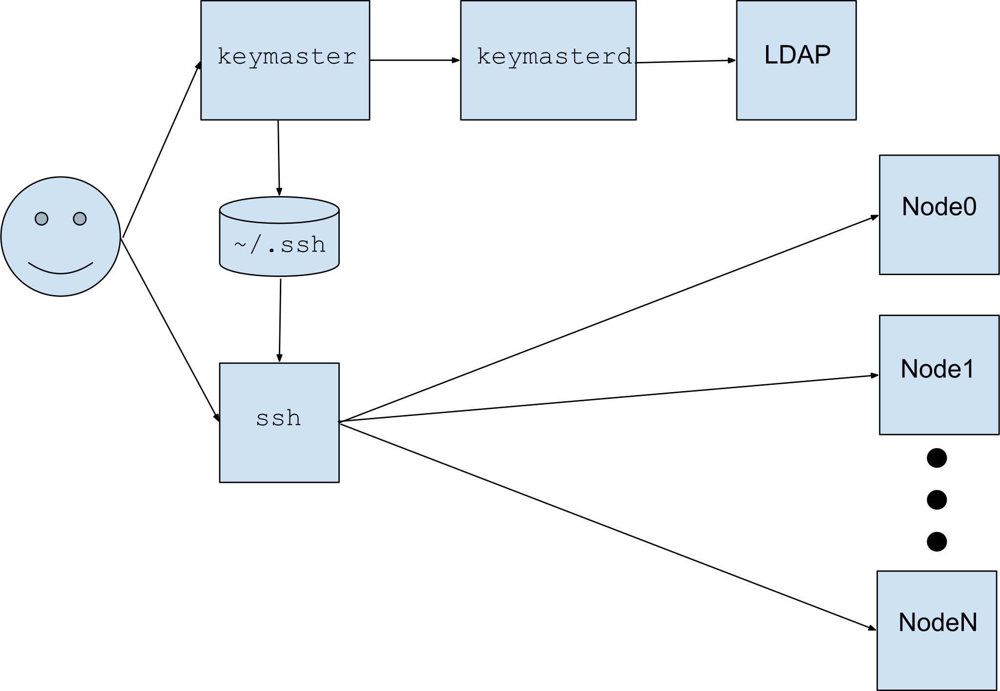
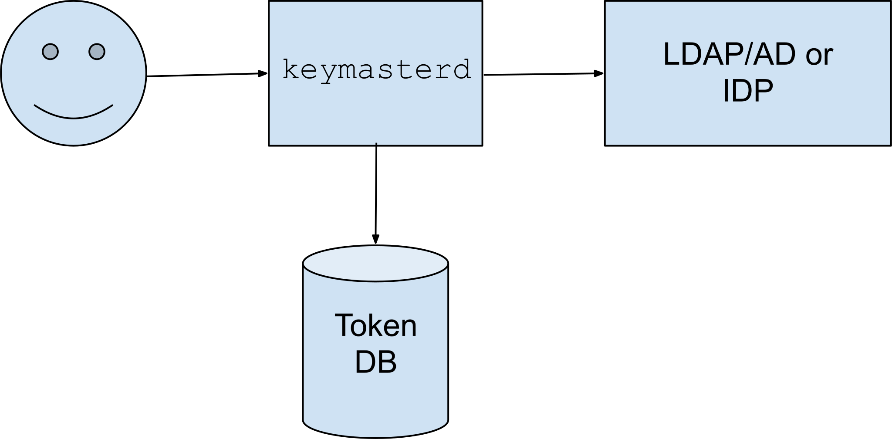

# Keymaster: Usable Short-term Credentials with Multi-Factor Authentication

#### Camilo Viecco[[1]](#footnote1), Richard Gooch
#### Symantec Corporation

[https://github.com/Symantec/keymaster]()

## Summary

We describe a multi-factor authentication system which issues short-lived credentials (SSH certs, SSL certs, Kerberos tickets, API keys, Web tokens, etc.) to users and automation accounts. This system is easy to use, configure and administer and has been engineered to be highly available and resilient in the event of most other infrastructure failures.

# Background

In any organisation which uses computers the software developers, system administrators and operations personnel require login and/or command & control access to computer systems and applications. The most common authentication method relies on the nearly ubiquitous username and password pair. This login method is barely tolerable for infrequent access, and is not practical with frequent access and many machines to manage.

To address the need to access more systems or the needs of automation accounts, access keys are used. For login access, an SSH keypair is used; for access to APIs, SSL certs or API keys are used. These are long-lived secrets (keys) which grant access to a particular set of systems. Long-lived keys pose a security risk, as they are difficult to revoke in the case of a key compromise or leak; every endpoint that may trust a key needs to revoke access to a compromised key.

An effective defense against key exposure is to only ever issue short-lived keys (certificates) to users (i.e. one day). This limits the potential for unauthorised use of a key, as it has to be obtained and used before it expires. The Keymaster is a service that easily and securely issues keys to users.

# Requirements

Every organisation will have its own set of requirements when deciding on access control technology. At Symantec we built a list of requirements that then drove the design and development of Keymaster. We humbly suggest that other organizations adopt a similar set of requirements for their access control systems. We need a tool for restricting SSH access with the following properties:

* Users should need to interact with the system at most once per day
* Credentials must have a self-contained termination date
* Getting these short term credentials must involve a second factor (in the form of VIP Access (OTP) or U2F tokens) in addition to the users password
* Private keys must never leave the users’ system
* The system must include some UI for token self-management
* The application/system verifying the credentials should not need to interact with the issuer in real time (authentication servers should live on-premise whereas services may live in the Public Cloud with no network connectivity to authentication servers)
* Should not depend on any specific Public Cloud provider technology (i.e. no AWS KMS)
* Can output credentials for
   * SSH access
   * Kerberos ticket generation (x509 pkinit)[[2]](#footnote2)
   * Generic x509 client side certificates
* Supports a migration path from long-lived SSH keys recorded in LDAP to the new system
* Can be expanded to provide authentication services for Web services (i.e. act as an IDentity Provider)

While there are open source projects to generate SSH or x509 certificates none of them solve our list of requirements, thus we started on our Open Source (APL 2.0) certificate generation system: Keymaster.

## Regular authentication workflow

A user runs the keymaster client utility to obtain certificates to access systems. This utility connects to an available keymasterd server over a secure TLS channel. The keymasterd will direct the keymaster client to challenge the user for identification information, such as a password, OTP string or to touch a U2F (Universal 2 Factor) hardware token. The challenge responses are sent back over the TLS channel. If the keymasterd is satisfied with the responses, it sends back a variety of keys/certificates/tokens to the client. The keymaster client will write the key materials to the appropriate places so that they are available to the software that uses those keys to authenticate. The keymasterd can also send error or informational messages (i.e. “access denied” or “upgrade your client in 30 days”) back to the client for the user to see. It is suggested that key materials expire after a day, so that users need to re-authenticate only once per day (assuming that is the policy set by the administrator).

Once a user has a key for the day, keymaster is not needed for any authentication operation. The keymasterd has signed the key and services which need to authenticate users (i.e. sshd) and the services are configured to trust the signing keys of the keymasterd. There is no communication between the keymasterd and services such as sshd.

The keymasterd does not directly authenticate user passwords, instead it passes username and password information to an external service such as LDAP to verify identity. The keymasterd also maintains a database of second-factor (2FA) tokens that it may use to present further challenges to the user.

The following diagram shows the authentication workflow:

## Token management

The keymasterd provides a webpage which users can use to manage their 2FA tokens. Users can add, list and remove tokens. Supported token types include U2F and VIP Access. Once a U2F token is registered (or if VIP Access is configured), users must authenticate with one of their 2FA tokens. Users authenticate with the webpage using one of the supported methods:

* Binding to LDAP/ActiveDirectory. Once username and password are verified, a 2FA challenge is presented
* Delegating to a specified Identity Provider that supports OAuth2 or SAML (i.e. Lemon LDAP or Symantec Access Manager). The Identity Provider is responsible for 2FA challenges

The following diagram shows the token management components:

## Threat Model

Keymaster assumes the integrity and authenticity of its permanent storage. Confidentiality is not assumed (we expect attackers to be able to obtain backup versions/filesystem snapshots of the keymasterd servers).  Keymaster assumes attackers cannot obtain a full memory dump of any keymasterd server.

At service start time keymasterd servers start in a locked-down state, waiting for injection of secrets from an admin service or other keymasterd servers in the cluster. This secret is NOT the actual data, but key fragments needed to reconstruct a secret to decrypt its local storage.

# Resiliency and High Availability

Keymaster is intended to be the sole issuer of identity credentials. As such, it is a critical service; if it is down, users cannot generate fresh credentials. Keymaster has multiple features to make it resilient and highly available. The design philosophy is to minimise external dependencies and to mitigate the effects if an external dependency does fail. Below are features and deployment recommendations to ensure resiliency and high availability.

## Round-robin DNS

Keymaster does not depend on the conventional approach to high availability, which is to deploy multiple instances with a load balancer between users and the instances. This approach, while an improvement over a single Keymaster instance, adds complexity and a dependency on a load balancer, which is itself a single point of failure.

The keymaster client and web browsers support round-robin DNS. The IP address of each Keymaster server is added to the DNS record (i.e. keymaster.yourcompany.com) and the client will try all the listed IP addresses automatically. Web browsers have similar behaviour. This approach moves the “find a healthy server” logic from the load balancer to the clients, and thus the load balancer is no longer needed.

## Caching of the Token DataBase

In a secure configuration, Keymaster requires a second factor, either VIP Access OTP or a U2F challenge. There is a single database containing the list of U2F tokens for the users. The token database is copied to a read-only cache local to each keymaster server. Users who have registered U2F tokens can continue to sign in and obtain credentials even if the VIP Access service or the U2F remote token database are unavailable.

The impact of the remote U2F token database becoming unavailable would be that users can no longer register or unregister their U2F tokens. This is a rare operation (generally once or twice per user over their tenure at the organisation), thus losing access to the remote database is very low impact.

## Caching of Salted, Hashed Passwords

Keymaster requires users to enter their password (this is their first authentication factor) in order to generate fresh credentials. Keymaster supports authenticating with a local password database on the keymaster servers, however this mode of operation will require separate mechanisms to manage and distribute the password database. We expect that most deployments will connect to an LDAP/AD service to perform password validation. This introduces a dependency on the LDAP service. If this service is unavailable, users will be unable to authenticate. One approach to limit the impact of LDAP failures is to co-host keymaster and LDAP servers, so that every keymaster server has a local LDAP server to use for authentication. This is a robust solution, but requires deploying more LDAP servers, which are non-trivial to configure.

Keymaster has temporary access to the password of every user who authenticates with it (users provide their password to keymaster and it connects to LDAP to verify it). Keymaster will generate a salted, hashed password and store that in the remote database (the same one used for the U2F token database), where it is then distributed to the read-only cache for all the keymaster servers. The password is hashed with the best currently available password hashing function (Argon2[[3]](#footnote3), with extra iterations), making each password very expensive to crack.

When a user authenticates with their password, LDAP is consulted, if it is available (the usual case). If LDAP is unavailable, the local salted, hashed password is checked. These salted, hashed passwords expire after a configurable time. We suggest 96 hours (4 days), so that an extended LDAP outage does not prevent issuing of credentials on the first day of work after a long weekend. Note that, as long as LDAP is working, users who are remove/disabled are immediately prevented from authenticating. A disabled user who attempted to authenticate would immediately have their cached, salted, hashed password invalidated.

# Status and Future Directions

## MVP
As of 27-July-2017, Keymaster has reached MVP (Minimum Viable Product) status. On 1-Aug-2017 we began an initial Production deployment. The MVP has the following features:

* User authentication with LDAP/ActiveDirectory
* OAuth2 (OpenID Connect) support (as RP)
* U2F token support
* HA via round robin DNS (smart clients)

## V1.0
* VIP Access (OTP) support (added 25-Aug-2017)
* Caching of Token DB to: (added 26-Oct-2017)
   * Improve resiliency if the Token DB fails
   * Improve performance for very large deployments
* Full event monitoring (added 25-Sep-2017)

## V1.1
* Generation of X509 certificates with group membership assertions for Kubernetes (added 24-Oct-2017)

## V1.2
* Administration console for U2F token management (added 31-Oct-2017)
* OpenID Connect support (as an IDentity Provider) (added 9-Nov-2017)

## V1.3
* Caching of hashed user passwords (added 12-Dec-2017)

## V1.3.1 (released 9-Mar-2018)
* Enhanced event monitoring for Web and Service Provider logins (added 8-Mar-2018)

## V1.4
* VIP Access Push support (added 13-Mar-2018)

## V2.0
* Automation user support

## V2.1
* PKCS11 (HSM) support
* Verification of certified U2F tokens
* Firefox and Chrome extensions to read credentials from local file-system

## Automation user support

Requiring 2FA based on user presence for automation users is not a viable operating model. If credentials are limited to 24 hours, every day an operator will have to generate a new credential, otherwise the automation will break (in other words, your Production deployment will break). Alternatively, if credentials for automation users are longer lived (perhaps 90 days), there is a greater risk of these medium term credentials leaking. If a credential is compromised, every endpoint will need to be updated to revoke (distrust) that credential. Furthermore, if an operator forgets to generate a new credential before it expires, again the automation will break. These approaches carry high risk of failure.

We propose a different model for generating credentials for automation users. A (real) user (with valid credentials) will use keymasterd to generate a special long-lived certificate. This certificate can then be used by the automation user to request keymasterd to generate a normal short-term credential which can be used to authenticate to services, ensuring that access is not lost. The special long-lived certificate is only useful for requesting normal credentials.

With this approach, if a long-lived certificate is exposed, it is easy to revoke it, as only keymasterd needs to process a revocation list. This indirection removes the burden of having to revoke a compromised credential on every endpoint. Revoking the long-lived certificate prevents the generation of new authentication credentials. There is no need to distribute new public keys/certificates to all the service providers, as they never see the long-term certificate.

This system can be further strengthened by embedding a list of authorised IP address blocks into the long-lived certificate. When the automation user uses this certificate to request a new credential from keymasterd, then keymasterd can check to see if the request came from and IP address in one of the authorised IP blocks. This approach yields a 2FA system where the second factor “user presence” is the location where the automation is running. This makes exploiting an exposed long-term certificate much more difficult.

## Broadening scope to cover Authorization

We are also considering broadening the scope of Keymaster to cover not only authentication but also authorization. This would allow organisations to eliminate a single point of failure (LDAP) when logging into systems or performing RPC API calls. Eliminating this runtime dependency improves operational robustness and lowers the administrative burden and expense of running a distributed network of LDAP servers.

To support this, keymaster would be extended to allow creation of SSL certificates that list access rights, group memberships, etc., expanding the scope of keymaster from authentication to authorization. Services such as sshd would read the certificate to obtain user ID, group IDs, groups memberships and would not need to contact an external system to obtain this information.

## True Single Sign-On

Keymaster could provide a true SSO experience for all authenticated access, whether SSH logins, API access or web pages. The following changes would be required:

* Enhance the WebUI so that it can be used as a Single Sign-On (SSO) page - including 2FA challenge - which can issue web cookies and serve as an IDentity Provider (IDP) using the OpenID Connect protocol
* Enhance the keymaster client to fetch web cookies from the keymasterd and write them to a local file so that a single login with keymaster yields all authentication credentials needed (SSH, SSL, API keys, web cookies)
* Write extensions for relevant Web browsers (i.e. Firefox and Chrome) to read web cookies from a local file

### Footnotes
<a name="footnote1">[1]</a> Camilo did all the hard work: design, development and deployment

<a name="footnote2">[2]</a> Hadoop’s security implementation requires the use of Kerberos. We also want to avoid the synchronization of Kerberos tickets and the need of password availability on public cloud servers.

<a name="footnote3">[3]</a> "The password hash Argon2, winner of PHC - GitHub." https://github.com/P-H-C/phc-winner-argon2. Accessed 19 Nov. 2017.
